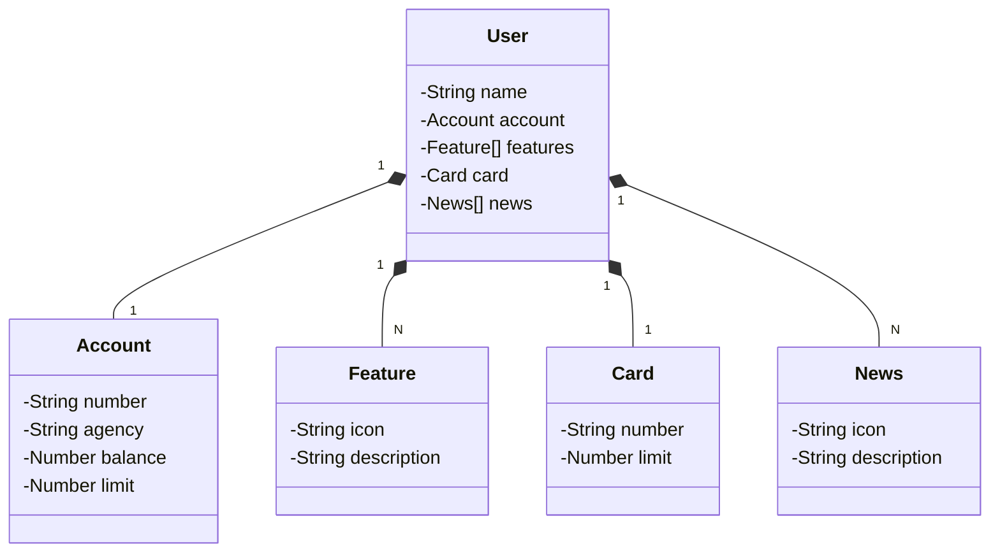

# java_restful_api
Java RESTful API

## Principais Tecnologias Utilizadas
- **Java 17**: Utilizamos a versão LTS mais recente do Java para tirar vantagem das últimas inovações que essa linguagem robusta e amplamente utilizada oferece;
- **Spring Boot 3**: Trabalhamos com a mais nova versão do Spring Boot, que maximiza a produtividade do desenvolvedor por meio de sua poderosa premissa de autoconfiguração;
- **Spring Data JPA**: Exploramos como essa ferramenta pode simplificar nossa camada de acesso aos dados, facilitando a integração com bancos de dados SQL;
- **OpenAPI (Swagger)**: criamos uma documentação de API eficaz e fácil de entender usando a OpenAPI (Swagger), perfeitamente alinhado com a alta produtividade que o Spring Boot oferece;
- **Railway**: utilizamos pois facilita o deploy e o monitoramento de nossas soluções na nuvem, além de oferecer diversos bancos de dados como serviço e pipelines de CI/CD.

Diagrama de Classes (Domínio da API)

